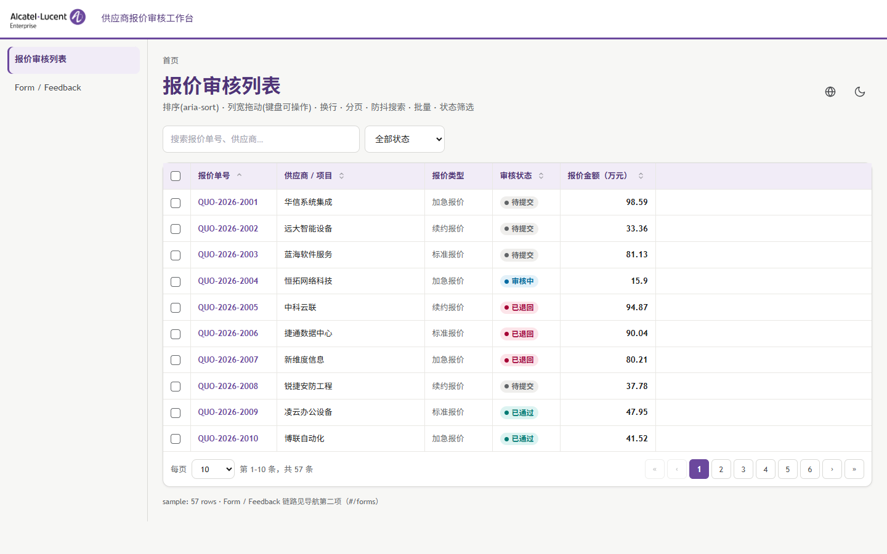
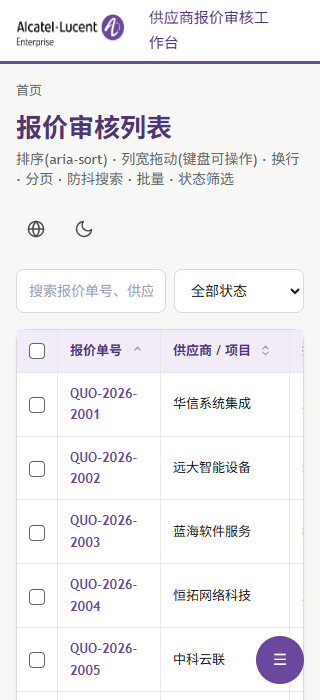

# 接手验收与确认报告（2026-09-12）

> 作者：接手方 AI 助手（ZCode / GLM）
> 性质：回应 `docs/HANDOVER.md` §10 移交确认清单——本次完成前两项并回填证据，供移交方核对是否"真正接上手"。
> 结论先行：**§10 第 1、2 项已完成**。design:check 在两个目标（线上 203:8091 / 本地 spec-site）各跑通一次，均 12/12 PASS；tokens:contrast 断言通过（当时的'46 对 ALL PASS'总述口径过宽——R17 修正：实为 PASS 40 / EXEMPT 4 / SKIP 2；补齐 dark on-action 值后为 PASS 42 / EXEMPT 4 / SKIP 0）；决策树选型演练已按 USAGE 场景 1 完整走完（拷骨架→改页面→真实浏览器验证）。

---

## 0. 接手环境概况

| 事项 | 状态 |
|---|---|
| 克隆 | `git@github.com:apllozhang/webui.git` → `D:\AIWork\ZCode\Vibe Coding\WEBUI\webui`，HEAD `84737b8`，与 origin/main 同步 |
| SSH | 私钥装入 `C:\Users\tinal\.ssh\id_ed25519`，指纹与移交时登记一致（`SHA256:bghaEHvFpOkp1pPwjS6pWs7j06ASTM+o93i2c2AxUrE`）；GitHub 主机密钥核对官方指纹后写入 known_hosts；认证通过 |
| 网络 | github.com HTTPS 443 被墙（与 AGENTS.md 记载一致），SSH 22 正常 |
| Node | 本机无全局 node；使用便携版 `D:\Tools\nodejs`（v22.23.2 / npm 10.9.8），未入 PATH，按需前置 `export PATH` |
| 线上站 | `http://10.10.10.218:8091` 本机**不可达**；按"203 ≡ 218 同一台机"改用 `http://10.20.30.203:8091`（200 可达） |
| 浏览器 | Edge 在 `C:\Program Files (x86)\Microsoft\Edge\Application\msedge.exe`，puppeteer-core 门禁零下载可用 |

## 1. §10 第 1 项：跑通本地服务与 design:check（12 PASS）✅

执行口径按 HANDOVER §4.3（`kit/tools` 下 `npm run design:check`），实际跑了**两轮**：

**第一轮：线上目标**（默认 218:8091 不可达，`--url` 换 203:8091，与 HANDOVER "203=外网视角" 一致）

```
node build-tokens.mjs --check && node design-check/check.mjs --url http://10.20.30.203:8091/
--check：零差异
PASS  VER  版本一致性（title ↔ version.json）
PASS  ASSET-LOCAL  核心资产存在（全部候选目录）
PASS  OVF-320 / OVF-375 / OVF-768 / OVF-1024 / OVF-1440  五档无横向溢出
PASS  HIT-NAV  导航链接命中自身
PASS  HIT-CTRL  表格控件热区 ≥44px  — sort:44 pg:44 checkbox:44 iconBtn:40
PASS  HIT-ICON  图标按钮热区 ≥40px（桌面口径）
PASS  ASSET-HTTP  核心资产全部 HTTP 200
PASS  CONSOLE  控制台零未解释错误
=== design:check PASS ===
```

**第二轮：本地服务**（`spec-site` 起 `python -m http.server 8765`，`--url http://127.0.0.1:8765/`）——同样 **12/12 PASS**。入库的 `kit/tools/design-check/artifacts/design-check.json` 即第二轮产物：`{"url":"http://127.0.0.1:8765/","time":"2026-09-12T09:23:44.838Z","pass":true}`，共 12 项。

**附加（AGENTS.md 铁律 7 的完整口径）**：`npm run tokens:contrast` → 断言通过（R17 修正：三分类 PASS 42 / EXEMPT 4 / SKIP 0；原'46 对 ALL PASS'含 2 SKIP 未数值验证）；`tokens --check` 零差异（schema：57 primitive / 74 light / 32 dark / 4 component）。

**如实记录**：有一条**建议性 WARN**（非 FAIL，不拦门禁）——
`semantic.light/status-success-bg: 字面色 #dff4f2 未登记 primitives（建议登记命名基础值）`。
建议列入 M4 收尾的"规则 ID 全面覆盖"批次顺手处理（登记进 `tokens/primitives.json` 即消）。

## 2. §10 第 2 项：决策树选型 → 拷骨架 → 改一个页面 ✅

**演练需求**（虚构但贴近真实业务，对照 HANDOVER §1 的三类异构系统）：「供应商报价审核工作台」——登录后按项目审核供应商报价，批量操作、状态流转、导出。

**决策树走查（docs/v6/index.md 三问）**：

| 问题 | 回答 | 依据 |
|---|---|---|
| ① 业务是什么？ | **工具应用型**（继续第 2 问） | 有登录、有业务数据写操作，不是内容门户 |
| ② 交互模式？ | **数据工作台** → **React** | 主界面是筛选/排序/批量/状态流转的数据表格 |
| ③ 核心组件？ | **四链路全要**：App Shell + Form + Table + Feedback | 工作台四大件（导航壳、审核表单、14A 表格、结果反馈） |

交叉验证：与移交方在 HANDOVER §1 对 dan-cpl（报价管理 → React+Vite+TS）的形态归置一致。

**执行**：

1. **拷骨架**：`kit/skeleton-react/` → `D:\AIWork\ZCode\Vibe Coding\WEBUI\drill-quota-workbench`（骨架目录整体拷贝，含 tokens.css/preset/字体）。
2. **改一个页面**（严格按 USAGE 场景 1 第 4 步：只改品牌位与业务语义，**未动任何颜色/字号/间距**——那是令牌的事）：
   - `index.html` 标题 →「ALE 供应商报价审核工作台」
   - `src/i18n/zh.ts` / `en.ts`：app.title、table.title、搜索占位、列头（报价单号/供应商·项目/报价类型/审核状态/报价金额（万元））、状态词表（待提交/审核中/已通过/已退回）、类型词表（标准/加急/续约报价）
   - `src/lib/demoData.ts`：数据池换成报价单（`QUO-2026-2001…`，金额万元，57 行）
   - `src/components/DataTable.tsx`：`STATUS_TONE` 映射与筛选下拉同步新状态键（pending→neutral / reviewing→info / approved→success / rejected→danger，Badge 五档 tone 足够，未新增视觉值）
3. **验证（铁律 6：build 绿 ≠ 运行对）**：`tsc --noEmit` 干净；`vite build` 绿；再用 puppeteer-core + 本机 Edge 对构建产物**真实打开**：
   - 控制台零错误；`document.title` 与顶栏均为新品牌位；状态筛选下拉渲染新词表
   - 1440 桌面与 320 移动端截图（本目录 `assets/`）：320px 无溢出，F10 网格写法生效
   - 演练产物留在仓库外（`drill-quota-workbench\`、`_drill_verify.mjs`、`_drill_shots\`），未混入 repo

**1440 桌面实测**：



**320 移动端实测**：



## 3. 卡点记录与解除（供 §8 教训表补充）

| 卡点 | 现象 | 解除方式 |
|---|---|---|
| SSH 私钥一度缺失 | 新环境 `~/.ssh` 为空，SSH 认证 Permission denied | 移交方在 `sh/` 目录提供 `id_ed25519`（指纹与登记一致）→ 装入 `~/.ssh` + 重录 GitHub 主机密钥 |
| 本机无 node | `node: command not found`，但 kit/tools/node_modules 随仓库带齐 | 复用本机便携版 `D:\Tools\nodejs`，前置 PATH 即可（建议写入 AGENTS.md 环境事实） |
| 内网地址不可达 | `10.10.10.218:8091` 连接失败（000） | 按"203 ≡ 218"用 VPN 地址 `10.20.30.203:8091`；门禁本就支持 `--url`，零改动 |
| 骨架依赖安装 | 国内网络直连 npm 慢/不稳 | `--registry=https://registry.npmmirror.com`，145 包 3 秒装完 |

## 4. 与 AGENTS.md 记载的环境差异（建议下版更新）

- shell 实际为 **Git Bash**（非 cmd）；`python -c` 多行可用，但长逻辑仍建议脚本文件（维持原建议）
- SSH key 路径：`C:\Users\tinal\.ssh\id_ed25519`（原记载为 Administrator 账户）
- node：`D:\Tools\nodejs`（便携版，需手动挂 PATH）
- 仓库结构即单一真源（`webui` 克隆直接开发提交），旧"工作区↔_repo_stage 双副本"规则在新结构下不再适用，push 前同步步骤自然消失

## 5. 下一步确认

已读 §6 推进顺序，确认接续：**M4 收尾**（CI 化 design:check / tokens:check / tokens:contrast → GitHub Actions；正确/错误示例库；Alpine/Static 四链路对齐；规则 ID 全面覆盖）→ M5 三项目试点 → M6 干净发布包与 v6.0 正式发布。§10 其余四项（SSH 看两站、§8 教训表、术语对齐、v6.0 立项范围）中：两站健康状态已由本轮 ASSET-HTTP/CONSOLE 项间接验证，教训表已读；术语对齐与立项排期待与移交方/负责人会话确认。
